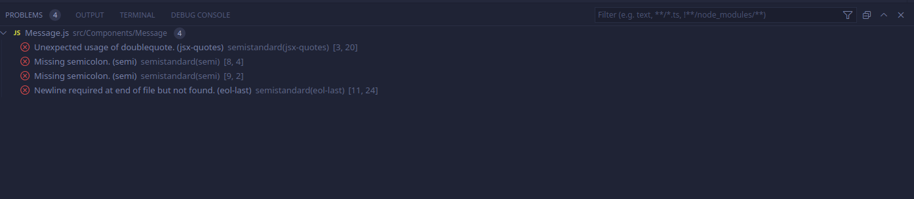

# StandardJS

## Documentation
* https://standardjs.com/
* https://github.com/standard/standard
* https://github.com/standard/semistandard
* https://marketplace.visualstudio.com/items?itemName=standard.vscode-standard

## Quick start
### Install as a development dependency:
```
$ npm install semistandard --save-dev
```

### Adding to VSCode:
* Open the extensions marketplace (Ctrl + Shift + X)

* Search for and Install `StandardJS` published by `Standard` (NOT by `Sam Chen` - as that is no longer being maintained)

* Open User Settings (Ctrl + Comma), search for `Standard`, and set the `Standard: Engine` setting to `semistandard`

* While still in User Settings, search for `javascript validate` and uncheck (disable) Javascript validation.

